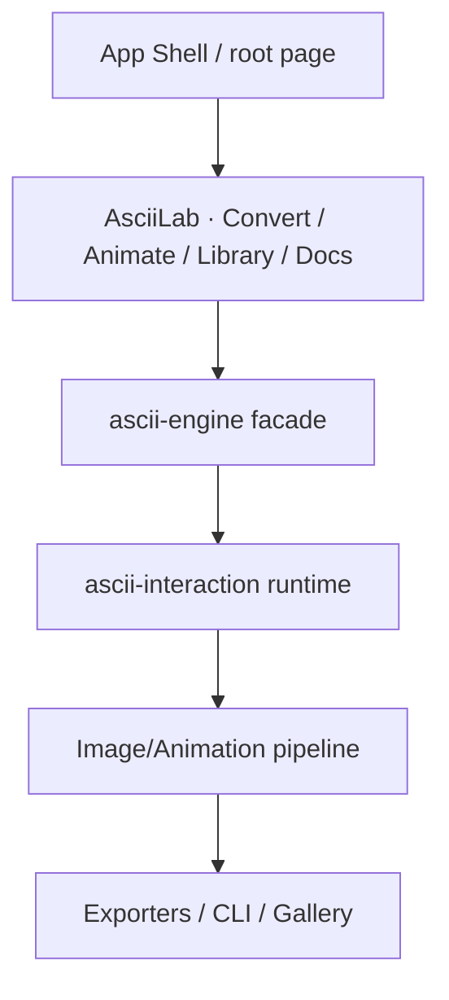

# Arquitetura do projeto

## Visão geral

O projeto é um monólito front-end em Next.js com foco em conversão e animação ASCII. A arquitetura documentada no branch `ascii-engine-platform` define três camadas principais:

- shell do produto (UI / app shell)
- fachada `ascii-engine` (SDK e re-export para produto)
- runtime `ascii-interaction` (core de render, física e pipeline)

## Fluxo arquitetural

## Módulos relevantes

### 1. APP shell

- `src/app/page.tsx` é a entry point da aplicação
- `metadata` define `ASCII Engine` como título e produto
- a página retorna `AsciiLab`

### 2. `AsciiLab`

- local: `src/studio/AsciiLab.tsx`
- define as tabs principais: Convert, Animate, Library, Docs
- integra presets, preview, histograma, conversão, exportação e galeria

### 3. Fase de produto

- `src/features/ascii-engine/index.ts` reexporta a fachada pública do produto
- o documento `PRODUCT_DECISIONS.md` define que recursos fora do escopo do produto devem sair do shell
- superfície experimental foi movida para `src/legacy`

### 4. Runtime

- `src/features/ascii-interaction` contém a engine, pipeline image, physics e conversão temporal
- o código e a documentação sugerem uma separação clara entre engine e shell

### 5. Módulos de produto da ASCII Engine

A documentação em `docs/modules/` descreve uma estrutura funcional consolidada:

- `sdk-facade` — ponto de entrada `createAsciiEngine()` e acesso estável ao produto
- `core-runtime` — runtime sem UI, com influence, physics, grid e render
- `converters` — `SourceAdapter` → `AsciiMatrix` / `AsciiAnimation`
- `editor` — edição e ferramentas de seleção/transformação
- `animator` — timeline, playback, scrubbing e operações temporais
- `playground` — efeitos interativos e presets dinâmicos
- `themes` / `presets` / `recipes` — identidade visual e presets reutilizáveis
- `gallery` / `icons` — biblioteca e preview de trabalho
- `exporters` / `importers` — serialização e importação de artefatos
- `plugins` / `nodes` — extensibilidade e grafo de processamento
- `storage` / `document` — serialização do projeto e estado de sessão
- `ai` / `benchmark` / `stats` — capacidades de instrumentação e suporte futuro

### 6. Estrutura de fluxo

A arquitetura do produto mostra que o valor está em:

1. receber entrada (imagem, GIF, canvas, etc.)
2. converter para matriz ASCII
3. aplicar presets, refinamento e efeitos
4. renderizar preview e exportar em múltiplos formatos
5. manter estrutura de documento e serialização do projeto

Esse fluxo é consistente com a decisão de produto “converter-first”.

## Decisão de arquitetura observada

A principal decisão é reduzir o produto a um shell focado em conversão e animação, sem manter a experiência de editor ou playground como centro da UX.

Isso atende a um princípio documentado:

> ASCII Engine exists to convert media into ASCII with the highest quality possible.

## Padrão de evolução

A documentação de arquitetura menciona fases de evolução:

- `ascii-engine-next`: baseline de fachada e shell
- `ascii-engine-platform`: produto standalone e converter-first
- legado experimental: deslocado, não descartado, mas desacoplado

## Observações de implementação

- Há evidência de exportação e CLI, mas sem backend próprio no estado atual.
- A arquitetura evita depender de um banco de dados para o processamento principal.
- A estrutura do código é modulada por feature, com foco em product shell + runtime + legacy.

## Status

Status: atual

A arquitetura observada no código e documentação atuais é consistente com uma aplicação front-end modular e de conversão ASCII, não com um “portfolio OS” em execução.
