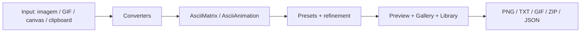

# ASCII Engine — visão profunda do produto

## Premissa de produto

A ASCII Engine não é um editor de imagens em estilo Photoshop nem um playground de efeitos como produto principal. O centro do valor do produto é a conversão de diferentes fontes de mídia para ASCII com qualidade, consistência e exportabilidade.

A linha direta do documento de decisão do produto é:

> ASCII Engine exists to convert media into ASCII with the highest quality possible.

Essa afirmação orienta o escopo do produto e justifica por que o shell foi reduzido a `Convert`, `Animate`, `Library` e `Docs`.

## Estrutura de produto

### 1. Shell de aplicação

O shell principal do produto está em:

- `src/app/page.tsx`
- `src/studio/AsciiLab.tsx`

Ele organiza a experiência em tabs e concentra a UX em:

- conversão de imagem
- conversão de animação
- biblioteca de templates, presets e gallery
- documentação do produto

### 2. Fachada `ascii-engine`

A fachada pública do produto está em `src/features/ascii-engine/index.ts` e reexporta a API principal do SDK. O módulo de documentação `docs/modules/sdk-facade.md` descreve a função da fachada como ponto de entrada estável para:

- `document`
- `storage`
- `editor`
- `converters`
- `nodes`
- `plugins`
- `ai`
- `playground`
- `presets`
- `exporters`
- `importers`
- `themes`

Esse desenho é essencial para separar "produto" de "runtime" e manter a extração futura possível em monorepo sem refazer todos os pipelines.

### 3. Runtime `ascii-interaction`

O runtime real de processamento está em `src/features/ascii-interaction` e o documento `docs/modules/core-runtime.md` explica que ele trabalha com:

- influence layer
- physics
- grid
- render
- image pipeline
- animation pipeline

A base central do runtime não depende de UI, de `ascii-engine` nem de Studio. Ele é o motor de renderização e comportamento físico que alimenta a conversão visual.

## Fluxo de valor principal

## Módulos observados e seu papel

### Converters

`docs/modules/converters.md` define o papel do registrador de adaptadores: transformar qualquer entrada em um fluxo de matriz/frames.

Pronto no ciclo atual:

- image
- gif
- svg
- clipboard
- canvas

Stubs / futuro:

- video
- webcam
- screen
- pdf

### Animator

A parte temporal do produto trabalha com:

- playback
- scrubbing
- FPS
- looping
- operações sobre frames
- persistência temporal

A arquitetura documenta que a conversão temporal não é só um detalhe: o produto faz uso de algoritmos de refinamento, ROI, dither temporal e fluxo de animação adaptativo.

### Presets, Themes e Recipes

A família de módulos `presets`, `recipes` e `themes` é importante porque dá linguagem visual e qualidade de saída. Isso deixa claro que a conversão ASCII tem um componente de estilo e refinamento além do processamento bruto.

### Gallery e Icons

A biblioteca do produto unifica ícones e galeria, dando suporte ao uso de referências e exemplos visuais de saída. Essa combinação é parte da experiência de produto atual, como indicado em `PRODUCT_DECISIONS.md`.

### Exporters e Importers

A conversão não termina na preview. O sistema expõe múltiplos formatos para exportação e serialização, o que é coerente com a natureza de ferramenta de media-to-ASCII.

### Nodes e Plugins

Esses módulos representam extensibilidade futura. O design arquitetural menciona `nodes` e `plugins` como caminho natural para evolução, mas a decisão de produto atual não os colocou como centro da UX.

### AI e benchmark

A experiência atual mantém `ai` e `benchmark` como módulos de suporte ou preparação. O documento de arquitetura indica que a AI é stubbed, sem rede real, e que `benchmark` serve para avaliação quantitativa da qualidade da conversão.

## Limites observados

Há consenso explícito na arquitetura sobre alguns limites importantes:

- performance ainda tem gargalos no main thread para conversão de imagem
- a engine não é um backend completo ou base de dados
- a extração para monorepo ainda não foi concluída
- o `ai` é stub; o produto não depende de rede para trabalhar
- a UI principal foi intenção deliberadamente reduzida para converter primeiro

## Status de execução

Status: atual

A ASCII Engine atual é um produto de front-end moderno, orientado a um fluxo de conversão e exportação em cliente, com runtime modular e arquivos de arquitetura bem definidos. O que é experimental e ampliado continua em módulo separado, enquanto o escopo principal e operacional permanece no shell converter-first.
